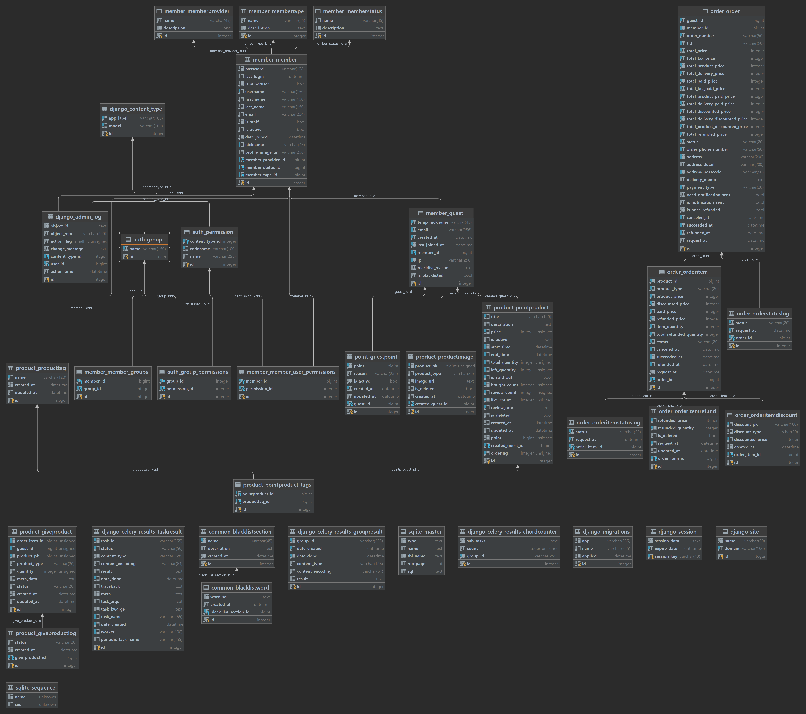

# Django Nully Backend API Template

Easy to set up Django backend API template with PostgreSQL database.

## Features

### Social Login
 <br>
<br>
**Naver**

## Requirements

 Version 3.11 <br>
 Version 14 (Docker file based) <br>
 (Celery, Cache) <br>
 (Optional) <br>

## CI/CD


## Deploy (Optional)

 (Optional) <br>


## Getting Started

```shell
# Clone the repository

# Create a virtual environment in the root directory
python -m venv venv

# Activate the virtual environment
# Windows
source venv/Scripts/activate
# Linux
source venv/bin/activate

# Install the requirements
pip install -r requirements.txt

# Define .env file
fab2 generate-env

-- Below is the example of .env file creating -- 
-----------------1----------------------
- Input SECRET_KEY:
----------------------------------------
This is a secret key for Django. 
You can generate it here: https://djecrety.ir/

"SECRET_KEY" Example: "django-insecure-......test..."
----------------------------------------

----------------2-----------------------
- Input KAKAO_API_KEY:
- Input KAKAO_SECRET_KEY:
----------------------------------------
You can get it here: https://developers.kakao.com/

[ More Explain ]
https://nulls.co.kr/bones-skins/482

"KAKAO_API_KEY" Example: "4df48d962f....."
"KAKAO_SECRET_KEY" Example: "sdfaefse....."
----------------------------------------

---------------3------------------------
- Input NAVER_API_KEY:
- Input NAVER_SECRET_KEY:
----------------------------------------
You can get it here: https://developers.naver.com/main/
"NAVER_API_KEY" Example: "4df48d962f....."
"NAVER_SECRET_KEY" Example: "sdfaefse....."
----------------------------------------

----------------4-----------------------
- Input KAKAO_PAY_API_KEY:
- Input KAKAO_PAY_CID:
----------------------------------------
For Kakao Pay, you need to get a separate key.
"KAKAO_PAY_API_KEY" Example: "897a....."
"KAKAO_PAY_CID" Example: "TC0ONETIME"
----------------------------------------

---------------5------------------------
[ More Explain ]
https://nulls.co.kr/bones-skins/483

"NAVER_API_KEY" Example: "jg5wTSCNqh....."
"NAVER_SECRET_KEY" Example: "zzZAXHt....."
----------------------------------------

----------------6-----------------------
- Input GOOGLE_CLIENT_ID:
- Input GOOGLE_SECRET_KEY:
- Input GOOGLE_REDIRECT_URL:
----------------------------------------
You can get it here: https://console.cloud.google.com/apis/credentials

"GOOGLE_CLIENT_ID" Example: "346021117315-ikur0p9aeup3i....."
"GOOGLE_SECRET_KEY" Example: "GOCSPX-i....."
"GOOGLE_REDIRECT_URL" Example: "http://127.0.0.1:8000/account/login"
----------------------------------------

----------------7-----------------------
- Input CHANNEL_HOST:
- Input CHANNEL_PORT:
----------------------------------------
Channels uses Redis as a channel layer.

"CHANNEL_HOST" Example: 127.0.0.1
"CHANNEL_PORT" Example: 6379
----------------------------------------

----------------8-----------------------
- Input CELERY_BROKER_URL:
- Input result_backend:
----------------------------------------
Celery uses Redis as a message broker.
Need to install Redis: https://redis.io/

"CELERY_BROKER_URL" Example: redis://localhost:6379/2
"result_backend" Example: redis://localhost:6379/2
----------------------------------------

----------------9-----------------------
- Input CACHEOPS_REDIS_HOST:
- Input CACHEOPS_REDIS_PORT:
- Input CACHEOPS_REDIS_DB:
----------------------------------------
Cacheops uses Redis as a cache.

"CACHEOPS_REDIS_HOST" Example: localhost
"CACHEOPS_REDIS_PORT" Example: 6379
"CACHEOPS_REDIS_DB" Example: 10
(redis db number)
----------------------------------------

----------------10-----------------------
- Input CACHES_LOCATION:
----------------------------------------
Cache uses location.

"CACHES_LOCATION" Example: redis://localhost:6379/1
----------------------------------------

-----------------11----------------------
- Input DB_ENGINE:
- Input DB_NAME:
- Input DB_USER:
- Input DB_PASSWORD:
- Input DB_HOST:
- Input DB_PORT:
- Input DB_TEST_NAME:
----------------------------------------
Database settings.

"DB_ENGINE" Example: django.db.backends.postgresql
"DB_NAME" Example: nully
"DB_USER" Example: postgres
"DB_PASSWORD" Example: postgres
"DB_HOST" Example: localhost
"DB_PORT" Example: 5432
"DB_TEST_NAME" Example: nully_test
----------------------------------------

------------------12---------------------
- Input EMAIL_HOST_USER:
- Input EMAIL_HOST_PASSWORD:
----------------------------------------
Host email settings.
Default Gmail if you want to use other email services, you need to change the settings.

"EMAIL_HOST_USER" Example: nully@gmail.com
"EMAIL_HOST_PASSWORD" Example: 1234
----------------------------------------

-----------------13---------------------
- Input AWS_IAM_ACCESS_KEY:
- Input AWS_IAM_SECRET_ACCESS_KEY:
- Input AWS_S3_BUCKET_NAME:
- Input AWS_SQS_URL:
----------------------------------------
AWS settings.

"AWS_IAM_ACCESS_KEY" Example: AKIAYXZ223G...
"AWS_IAM_SECRET_ACCESS_KEY" Example: AKIAYXZ223G...
"AWS_S3_BUCKET_NAME" Example: nully
"AWS_SQS_URL" Example: https://sqs.ap-northeast-2.amazonaws.com/1234/nully
----------------------------------------

# Define settings file
# local, development, production
export DJANGO_SETTINGS_MODULE=XXXX.settings.local

# Migrate the database
python manage.py migrate

# Run the server
python manage.py runserver

# Run the celery worker
celery -A config worker -l INFO -P solo
```

## Testing

Local Testing
```shell
python manage test --keepdb
```

## CI/CD Setting

### Deploying (self-hosted)

.github/workflows/deploy.yml

1. Edit `DJANGO_SETTINGS_MODULE`
2. `/var/www/ProjectName/` file directory of your project
3. Set well celery directory or remove celery part
```
name: celery restart
run: |
sudo /etc/init.d/celeryd restart
```

### Testing (Github action, When PR to `code-review` name branch)

- GitHub Actions (.github/workflows/test.yml)

## Database



## Setting CRON

Need to use by django command

`command.cron`

**[ Example ]**

By Local

```cronexp
30 * * * * . /var/www/ProjectName/bin/activate && cd /var/www/ProjectName && python manage.py django_commands >> /var/log/django_commands.log 2>&1
```

---

## Getting Start By Docker

### 1. Set env file

```shell
-- Set .env file
fab2 generate-env
```

### 2. `docker-compose.yml` file change `environment` for your `DJANGO_SETTINGS_MODULE`

### 3. create `temp_static` from root directory
```shell
mkdir temp_static
```

### 3. Run docker-compose
```shell
# Before you start, you need set .env file

docker-compose up --build
```

### 4. Set CRON setting

```cronexp
PATH=/usr/local/bin:/usr/bin:/bin
* * * * * cd /app && python manage.py check >> /tmp/log/django_commands.log 2>&1
```

If you want to see CRON log

```shell
# Check docker container id (find ...cron...)
docker ps

# Ensure the container is running
docker exec -it docker_container_id bash

# Check log
tail -f /tmp/log/django_commands.log
```
